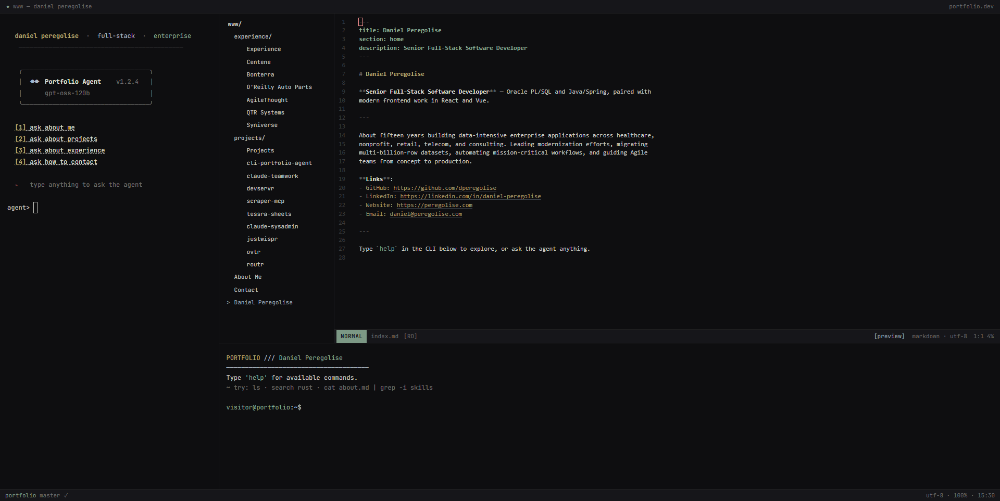
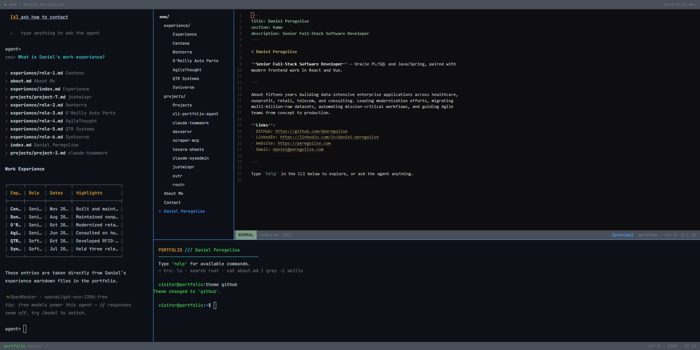
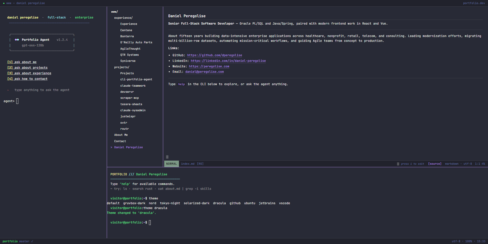

# cli-agent-resume

> **This repo doubles as my live resume.** The `www/` content is real — actual experience, projects, and contact details for Daniel Peregolise. If you're here from a job application or just exploring, you're in the right place.
>
> **Want your own?** Fork it, replace everything under `www/` with your content, and deploy. The shell, agent, editor, and file explorer are all yours to keep.

A CLI-aesthetic browser-based portfolio with a tmux-style panel layout: an AI agent shell on the left (full height), a NERDTree file explorer (top) over a CodeMirror Vim editor (bottom) on the right, and a collapsible CLI terminal along the bottom. Powered by a FastAPI/LangChain backend with a model cascade and a co-located routr proxy. Ships with a switchable theme system (`theme` command) — the default is a custom desaturated-steel palette, with Gruvbox, Nord, Tokyo Night, Dracula, and others selectable.



---

## Running locally

### Prerequisites

- Node.js 20+, npm 9+
- Python 3.11+
- A running routr instance on `127.0.0.1:8000` (or set `ROUTR_URL` to point elsewhere; the cascade falls back gracefully if routr is unavailable)
- At least one of: `OPENROUTER_API_KEY` or `HUGGINGFACE_API_KEY`

### 1. Install frontend dependencies

```bash
npm ci
```

### 2. Set up the backend

```bash
python3 -m venv .venv
source .venv/bin/activate        # Windows: .venv\Scripts\activate
pip install -r backend/requirements.txt
```

Create a `.env` file in the project root:

```bash
# Required: at least one cascade provider
OPENROUTER_API_KEY=sk-or-v1-...
OPENROUTER_MODELS=mistralai/mistral-7b-instruct:free,meta-llama/llama-3-8b-instruct:free

HUGGINGFACE_API_KEY=hf_...
HF_MODELS=mistralai/Mistral-7B-Instruct-v0.2

# routr proxy (completions-only, no tools forwarded)
ROUTR_URL=http://127.0.0.1:8000

# Rate limiting (optional — defaults shown)
AGENT_RATE_LIMIT=20
AGENT_BAN_DURATION_HOURS=24
```

### 3. Start the backend

```bash
source .venv/bin/activate
cd backend && uvicorn main:app --host 127.0.0.1 --port 8001 --reload
```

### 4. Start the frontend dev server

In a second terminal:

```bash
npm run dev
```

Open http://localhost:5173.

### Verify it works

```bash
# Health check
curl http://127.0.0.1:8001/health

# Send a message and stream the response
curl -N -X POST http://127.0.0.1:8001/agent \
  -H "Content-Type: application/json" \
  -d '{"messages":[{"role":"user","content":"Hello"}],"session_id":"test-1"}'
# Should stream SSE events: data: {"type":"token",...} ... data: {"type":"done"}
```

---

## Building for production

```bash
npm run build
```

Output lands in `dist/`. The Vite build bakes a static `dist/assets/manifest.json` from `www/**/*.md` — the portfolio content.

To verify the build output:

```bash
npm run preview   # serves dist/ at localhost:4173
```

---

## Running the routr proxy (optional, local dev)

routr is a completions-only proxy — it forwards requests to a model but **never** receives tool definitions (hard-asserted in code). If you don't have a live routr instance, the cascade will fall back gracefully.

```bash
pip install -r src/routr/requirements.txt
uvicorn src.routr.main:app --host 127.0.0.1 --port 8000 --reload
```

---

## Running tests

### Backend tests

```bash
source .venv/bin/activate
pytest backend/tests/ -v
```

86 tests, all green (unit + adversarial).

### Routr tests

```bash
cd src/routr
pytest tests/ -v
```

### Frontend tests

The frontend tests are plain Node.js scripts (no framework):

```bash
node src/tests/test-path-validation.mjs
node src/tests/test-manifest-validation.mjs
node src/tests/test-theme-manager.mjs
node src/tests/critic-adversarial-m5.mjs
# etc — all files matching src/tests/*.mjs
```

---

## Deploying to a VPS

See [`deploy/README.md`](deploy/README.md) for the full guide. Quick summary:

```bash
# 1. Fill in /var/www/portfolio/.env with API keys (see deploy/README.md §2)

# 2. Build and deploy
bash deploy/build.sh

# 3. Install and start the systemd service
sudo cp deploy/portfolio-agent.service /etc/systemd/system/
sudo systemctl daemon-reload
sudo systemctl enable --now portfolio-agent

# 4. Configure nginx
sudo cp deploy/nginx.conf /etc/nginx/sites-available/portfolio
sudo ln -s /etc/nginx/sites-available/portfolio /etc/nginx/sites-enabled/
sudo nginx -t && sudo systemctl reload nginx

# 5. TLS (recommended)
sudo certbot --nginx -d yourdomain.com
```

Verify after deploy:

```bash
curl https://yourdomain.com/health           # {"status":"ok"}
curl -N -X POST https://yourdomain.com/agent \
  -H "Content-Type: application/json" \
  -d '{"messages":[{"role":"user","content":"hi"}],"session_id":"s1"}'
```

---

## Portfolio content (`www/`)

The `www/` directory contains the Markdown files displayed in the Vim editor panel. The
files committed here are Daniel Peregolise's actual portfolio content. If you are forking
this project for your own use, replace everything under `www/` with your own content
before deploying. The structure expected by the manifest loader is:

```
www/
  index.md              landing / summary
  about.md
  contact.md
  experience/
    index.md
    role-*.md           one file per role
  projects/
    index.md
    project-*.md        one file per project
```

---

## Project structure

```
src/
  agent/        xterm.js agent shell + SSE client
  editor/       CodeMirror 6 + vim mode
  explorer/     NERDTree DOM file explorer
  drawer/       CLI drawer terminal + commands
  layout/       CSS grid layout + mobile responsive
  routr/        completions-only proxy (Python FastAPI)
  bus.ts        cross-panel event bus (FOCUS_FILE, THEME_CHANGE)
  theme.ts      multi-theme color system (default + Gruvbox, Nord, etc.) + theme manager
  types.ts      shared TypeScript interfaces
  manifest.ts   portfolio manifest loader + path validation

backend/
  main.py       FastAPI app (POST /agent SSE endpoint)
  agent.py      LangChain agentic loop
  cascade.py    model cascade: OpenRouter → HuggingFace → routr
  tools.py      search_portfolio + focus_item LangChain tools
  manifest.py   www/ content index + keyword search
  rate_limiter.py  sliding-window IP rate limiter + 24h ban

deploy/
  portfolio-agent.service   systemd unit
  nginx.conf                nginx reverse proxy config
  build.sh                  build + deploy script
  README.md                 full VPS deployment guide

www/            portfolio content (.md files, served as static + indexed)
```

---

## Architecture notes

**Model cascade**: every agent request tries OpenRouter first (free-tier models), falls back to HuggingFace, then falls back to routr. If all three fail, a structured SSE `error` event is returned. routr is a completions-only proxy — `tools` and `tool_choice` fields are **never** forwarded to it (hard-asserted with `assert tools is None` before the HTTP call).

**Cross-panel events**: the `EventBus` (`src/bus.ts`) connects the panels. `FOCUS_FILE` events from the agent shell or CLI drawer cause the NERDTree explorer and Vim editor to navigate to and display the file. `THEME_CHANGE` events from the CLI `theme` command update all panels simultaneously across all bundled themes.

The agent answers from the portfolio content and emits `focus_item` events as it goes — here it's asked about work experience, lists the source files it pulled from, and renders the result inline:



The `theme` command swaps the palette across every panel at once (here switching to Dracula); the editor also toggles between rendered-preview and raw-source views:



**Rate limiting**: 20 requests per IP per 60-second sliding window. On breach, the IP is banned for 24 hours. The ban timestamp is returned in the `X-Client-Banned-Until` response header and stored in `localStorage` so the browser shows a friendly message without hitting the server again.

**SSE wire contract**: `POST /agent` returns a text/event-stream with five event types: `token` (streamed LLM output), `focus_item` (navigate editor to a file), `search_results` (keyword search hits), `done` (stream complete), `error` (structured error).

---

## License

This project is released under the [GNU General Public License v3.0](LICENSE). See the
`LICENSE` file for full terms. Contributions are welcome under the same license — see
[CONTRIBUTING.md](CONTRIBUTING.md).
